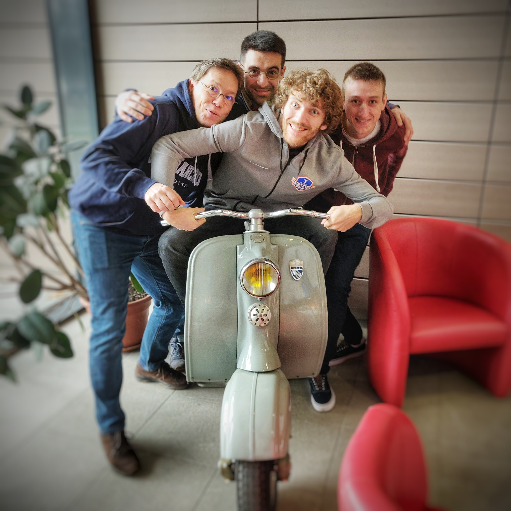

# 24hcode2019

Contest of the 24h of code 2019 in Le Mans

## The contest

The contest contain two objectives :

1. Find an stop sign on openstreetmap which is not fully documented in order to update it (add the orientation data for example)

2. Automatically find and add data to openstreetmap (an unknown stop sign for example)

## Pre-requisite

You must install python modules listed in requirements.txt.

It is recommanded to use either conda or pip.
Please note that pytorch cannot be installed directly with conda or pip, you should use the command line helper on [Pytorch](https://pytorch.org/get-started/locally/) and choose your cuda version (or None if you don't have cuda installed).

Running this software without cuda require to set "use_gpu=False" instead of "use_gpu=True" when instanciating the stop_sign_recognizer class, for example in "test_model.py", "train_model.py" or "Osmose.py".

## How it works

## Ressources

### Mapillary : https://www.mapillary.com and OpenStreetCam : https://www.openstreetcam.org/

Grab images from road

### Osmose : http://bit.ly/24hosmose

Repository from detected anomalies in openstreetmap

### Overpass : https://overpass-turbo.eu/s/Fez

Offer an high-level API over openstreetmap date

### Contest' specific server

API and Openstreetmap server for the contest : http://bit.ly/24HOSM

====
pour Dominique :
[out:json][timeout:25];area(3600107435)->.searchArea;(node["highway"="stop"](area.searchArea););out body;way(bn);out body;>;out skel qt;
